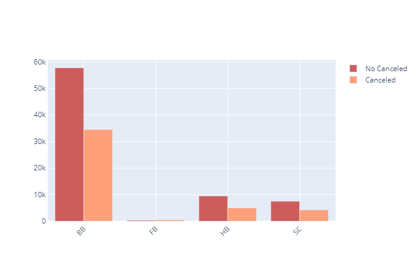

# Analysis-and-prediction-of-hotel-bookings-dataset

[Hotel bookings dataset](https://www.kaggle.com/jessemostipak/hotel-booking-demand), 该数据最初摘自Nuno Antonio，Ana Almeida和Luis Nunes为2019年2月第22卷的数据简介撰写的[酒店预订需求数据集](https://www.sciencedirect.com/science/article/pii/S2352340918315191)。现已由 Thomas Mock 和 Antoine Bichat 在2020年2月11日下载清理并[发布](https://github.com/rfordatascience/tidytuesday/blob/master/data/2020/2020-02-11/readme.md)。

该数据集具体包含两个不同酒店（度假酒店和城市酒店）在预订到达日期之前的数据，其中包括一家度假酒店和一家城市酒店。具体变量包括诸如预订的时间、停留时间、成人、儿童或婴儿的数量以及可用停车位的数量等信息，总计36个。

本项目的工作主要为两个部分，第一是基于该数据集进行探索性数据分析（EDA），进而挖掘出数据集包含的一些潜在信息；第二是基于因变量（is_canceled）建立一个有效的模型来预测客人是否真的会来，为酒店具体营业计划的制定提供一些支撑。

## 1.探索性数据分析

对数据集以及相关变量的具体分析，我希望能够解决以下问题：

 - 客人来自哪里，其年龄组成是怎么样的？
 
 - 客人平均预订多少时间，具体分布？
 
 - 通过meal分析客人对于服务的需求？
 
 - 一年中房价如何变化，客人每晚为一间客房支付多少费用？
 
 - 一年中哪个月最忙，或者哪个时间段最忙？
 
 - 人们在酒店平均停留多长时间，两个酒店各自的平均停留时长？
 
 - 预订的取消主要来自于哪个时间段，哪个酒店的取消情况更少？
 
 - 客人预订的入住时间主要是周几？
 
 - 客户提出的特殊要求的数量对取消预订的影响？
 
 - 来自公司的预订有多少，哪家公司是高质量客户（订单多且取消少）

首先，我们需要载入数据集并看一下其具体的大小以及是否需要补缺。

### 1.1 数据预处理

主要是根据Nuno Antonio等对该数据的[补充说明](https://www.sciencedirect.com/science/article/pii/S2352340918315191)对数据集进行相关调整，并对缺失值进行。

### 1.2 客人来自哪里，其年龄组成是怎么样的？

通过1.2的图1和图2，可以发现，这两家酒店的预订者来自世界各地，但是其中一般以上的客户来自于PRT、GBR和FRA这三个国家，即葡萄牙、英国和法国，而葡萄牙的客户尤其钟爱这两家酒店，占总体用户的28%。

此外，通过图3这些客户中主要以成人为主，以青少年为主要构成的客户只占1.74%，而以儿童为主要构成的客户只有16家，仅占比0.02%。

### 1.3 客人平均预订多少时间，具体分布？

通过1.3的图1，可以发现，客户的预定天数呈现一种右偏分布，大多数客户会预订1-4天，每位用户平均会预订3天。而在这其中，Resort Hotel的客户平均预订天数大于City Hotel。

### 1.4 通过meal分析客人对于服务的需求？

总的来说，大部分客户都会选择BB套餐，即住宿+早餐，这也符合我们一般的认知。

同时，值得注意的是，选择FB套餐的客户有更大的几率取消预订，一般的客户并不会选择由酒店提供全部的食宿，而图表也的确证明了这一点。这一现象可能是由于该用户并不确定自己是否真的需要该酒店的服务（不确定旅行的时候是否有假期等等），因此没有认真的进行预订。

### 1.5 一年中房价如何变化，客人每晚为一间客房支付多少费用？

可以发现，胜地酒店（Resort Hotel）在夏季特别是八月左右的时候其房价将达到全年的峰值。但是在其他的季节，胜地酒店的房价则相对处于一个较低的水平。

而城市酒店（City Hotel）则相对稳定，其平均房价除了夏季之外其他的季节均稳定在胜地酒店之上，其房价高峰在4-9月之间，连续性较强。

### 1.6 一年中哪个月最忙，或者哪个时间段最忙？

总体而言，春秋两季是这两家酒店的旺季，其有效旅客量达到全年的高峰。具体来说，城市酒店（City Hotel）每个月的旅客量均大于胜地酒店（Resort Hotel），在旅客旺季（即春秋两季）这种离散程度更是达到了高峰。

此外，5到6月、10到11月，两家酒店的旅客数量都呈现一个显著的下降，这说明夏、冬两季旅客相对较少，其中又以冬季最为萧条。

最后，结合1.5的图，可以判断出，城市酒店（City Hotel）的盈利能力远超胜地酒店（Resort Hotel）。

这是由于城市酒店（City Hotel）在其价格高峰季时也恰好是其旅客高峰期，这说明该酒店的服务质量相对胜地酒店（Resort Hotel）更为客户认可。而胜地酒店在其旅客高峰期间其房价相对较低，这说明该酒店的核心竞争力可能不强，只能通过降低房价以完成吸引顾客的目的。

### 1.7 两个酒店各自的旅客入住时间主要是周几？

!

根据上图，可以发现，周五往往是是旅客们最多选择的入住时间，其次是周一。而选择周二入住的旅客最少。

### 1.8 预订的取消主要来自于哪个时间段，哪个酒店的取消情况更少？

可以发现，城市酒店（City Hotel）的客户预订取消比例显著高于胜地酒店（Resort Hotel）;其中，城市酒店的预订取消较为稳定，大致在40%左右，而胜地酒店则呈现夏季高，冬季低的周期性波动。

### 1.9 客户提出的特殊要求的数量对取消预订的影响？

根据总体订单、取消预订订单和未取消预订订单的分布情况，结合上图，可以发现，取消预订的订单的特殊要求数量往往较少。

我猜想，这是由于该订单并不确定自己是否真的会履行该预订或是确定自己很有可能不需要该预定，因此对于酒店的特殊需求几乎不存在（因为他知道自己根本不会来）。而真正会来的旅客往往会有一些特殊需要，如双人床等等，这些旅客的确会在酒店住宿，因此也会提出自己的要求来使得自己获得应有的服务。

### 1.10 来自公司的预订有多少，哪家公司是高质量客户?

可以发现，ID为0、40、223和45的公司都提供了大于200的订单，有效订单占比均超过60%。其中0号公司的订单和有效订单贡献最多，有效订单相当于其他三家公司有效订单总数的40倍，总体有效订单的92%。

因此，可以认为0号公司是这两家酒店的主要公司客户。

### 1.11 当前预订之前取消（或不取消）的先前预订的数量能否反映客户取消当前预订的意愿？

通过上图，可以发现当前预订之前取消（或不取消）的先前预订的数量同客户是否取消订单之间并不具备显著的相关关系.

### 1.12 EDA小结

**通过探索性数据分析，我得出了以下结论：**

 - 这两家酒店的订单主要来自于欧洲尤其是葡萄牙、英国和法国这三个国家，预约订单中绝大部分是以成人为主体的客户。
 - 订单的预定天数呈右偏分布，大多数客户会预订1-4天，总体来说，每位用户平均会预订3天。具体来说，Resort Hotel的客户的平均预订天数大于City Hotel。
 - 大部分订单属于BB套餐订单，即住宿+早餐。此外，FB套餐订单较其他订单有更大的几率取消预订。
 - 总体而言，City Hotel的平均房价高于Resort Hotel，但在夏季特别是八月左右Resort Hotel的平均房价将超过City Hotel达到全年的峰值；相对而言，Resort Hotel的平均房价波动性较大。同时，一年中春秋两季是这两家酒店的旺季，其中City Hotel的每月旅客量远大于Resort Hotel，这种差距在春秋两季尤为明显。因此，可以判断出City Hotel的营业收入远超Resort Hotel，这也反映了相对而言City Hotel的服务更为客户认可。
 - 预约订单往往会选择周五入住，其次是周一；而周二入住的相对最少。
 - City Hotel的订单取消比例显著高于Resort Hotel，约40%；而Resort Hotel的订单取消比例则呈现夏季高冬季低的周期性波动。
 - 相对而言，订单的特殊要求数量越少，取消订单的可能性越大。
 - 编号为0的公司是这两家酒店的最主要的公司客户，编号为40、223和45的公司是相对重要的公司客户。

## 2.预测酒店预约的取消情况

### 2.1 特征筛选与数据处理

 - ReservationStatus：Categorical
 - Reservation last status, assuming one of three categories:
 - Canceled – booking was canceled by the customer;
 - Check-Out – customer has checked in but already departed;
 - No-Show – customer did not check-in and did inform the hotel of the reason why
 
 
 - ReservationStatusDate：Date
 - Date at which the last status was set. This variable can be used in conjunction with the ReservationStatus to understand 
 - when was the booking canceled or when did the customer checked-out of the hotel
 
通过上述说明，可以知道 ReservationStatus 和 ReservationStatusDate 这两个变量包含因变量的信息,应该直接删除.

此外，通过以下步骤，将原始特征进行了重新处理、划分：
 - 将country重新划分"PRT"、"GBR"、"FRA"、"ESP"、"DEU"以及"other";
 - 确定所有的连续变量和离散变量;
 - 对连续性自变量进行标准化，对离散型自变量进行独热编码;
 - 划分训练集和测试集,由于这批数据的时间跨度在2015年7月到2017年8月,考虑到数据划分的合理性，则不能使用常见的随机划分，而应该按时间划分数据，将2015年7月-2017年3月划分为训练集.

### 2.2 建立预测模型并评估模型性能

分别比对了DT、LR、RF、SVM和XGBoost五类常见的分类模型，选出对该数据集泛化能力最好的XGBoost模型。

**其ROC图如下：**

可以发现，通过初步的参数调优，模型的泛化性能有了一定的提升。当然，以上只是进行了初步的调参，在此之外还可以通过对gamma、subsample 、colsample_bytree、reg_alpha 等参数的调整对模型进行进一步的优化。

值得注意的是，XGBoost的参数调整优化并不能大幅度提升模型性能，需要更高的精度和泛化能力的话可以根据自己的需求对特征构成、数据处理这两个方面进行更个性化的处理和调整。
